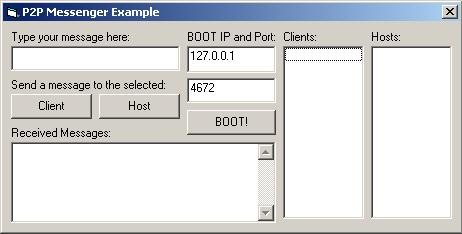



## True P2P Instant Messenger Example

### Description

When I first started this project, I had a few problems. One of them was, "How in the heck do I, as a client that knows nobody on the network, find someone that is on the network?" I was dumbfounded, I wondered how KaZaA did it, as well as Gnutella and Overnet.

I did a little research and found that they were very smart about it, it is not as complicated as one would think. Your KaZaA or whatever you download comes with a list of people already on the network! You load that file up and it tells you a few people to connect to, then you work you way from there, getting IP's from everyone you can possibly get. Every time you meet a new connection on the network, they tell you everyone they know, and you do likewise.

My software is a very small implementation of this idea, however it can be expanded fairly eaily. So, let's get on to geting started with this application, so you can see how it really works.

I have commented as best I can, and provided as much information as I could possibly provide off the top of my head to make this a learning experience and not some frustrating endeavor.
 
### More Info
 

             |
---                |---
**Submitted On**   |2003-10-14 23:10:40
**By**             |[Travis Rowland](https://github.com/Planet-Source-Code/PSCIndex/blob/master/ByAuthor/travis-rowland.md)
**Level**          |Intermediate
**User Rating**    |4.9 (39 globes from 8 users)
**Compatibility**  |VB 5\.0, VB 6\.0
**Category**       |[Internet/ HTML](https://github.com/Planet-Source-Code/PSCIndex/blob/master/ByCategory/internet-html__1-34.md)
**World**          |[Visual Basic](https://github.com/Planet-Source-Code/PSCIndex/blob/master/ByWorld/visual-basic.md)
**Archive File**   |[True\_P2P\_I16588010152003\.zip](https://github.com/Planet-Source-Code/travis-rowland-true-p2p-instant-messenger-example__1-49229/archive/master.zip)

